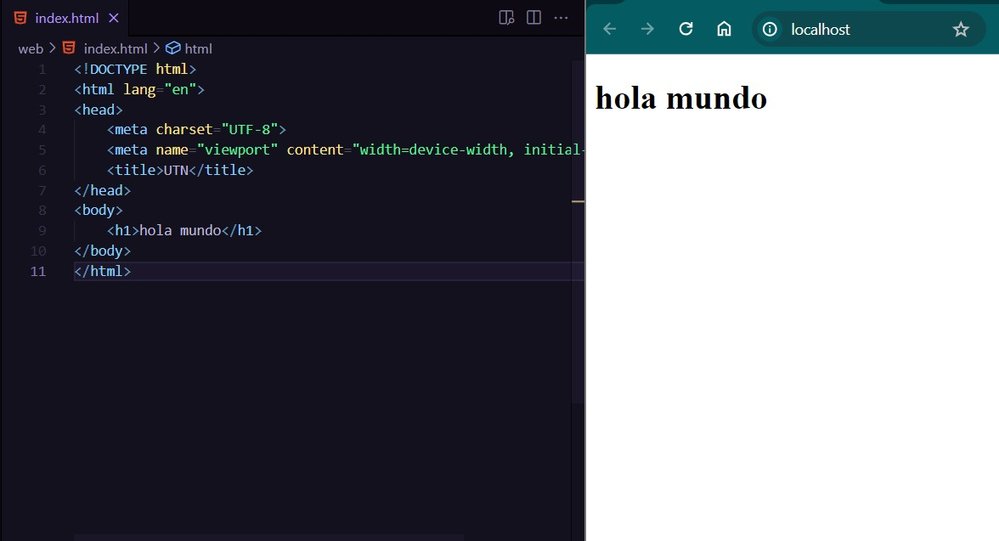
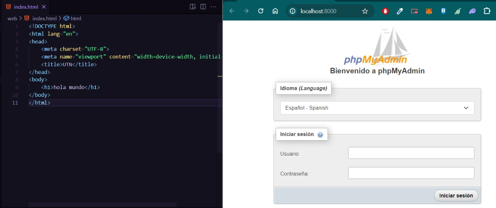
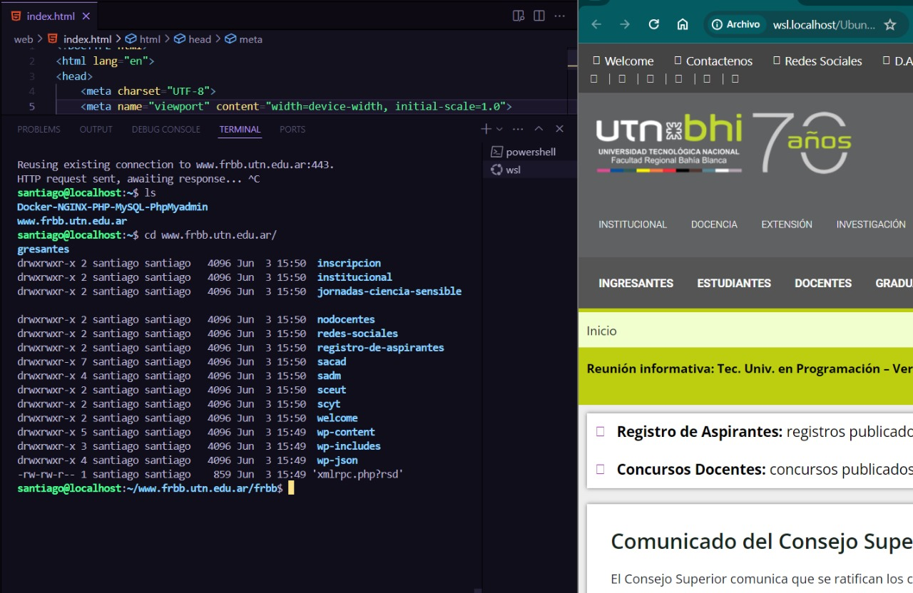
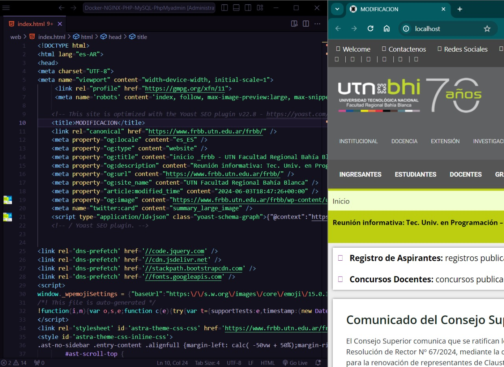

# tp3
## 1a
Con hilos se ejecuta aproximadamente en un promedio de 10 veces un segundo mas rapido. debido a la forma en que se gestionan las tareas y los recursos del sistema(sin hilos se ejecuta de manera secuencial). Al usar hilos, podes ejecutar distintas tareas de manera simultánea, lo que permite que partes del programa se desarrollen de forma independiente. Esto optimiza el uso de los recursos del sistema, potencialmente mejorando su eficiencia.

## 1b 
comparando con otro estudiante, el tuvo con hilos 4,01460 mientras que yo tuve 4.05920 y sin hilos tuvo 5.13283 y yo tuve 5.23259.

## 1c
En la versión inicial del código, ambos hilos manipulan la variable “acumulador “sin sincronizarse. Este descuido puede provocar una situación de "race condition" o carrera crítica, donde los hilos compiten por acceder y modificar "acumulador", dando lugar a resultados inesperados.

Al sacar los comentarios, las operaciones de incremento y decremento en los hilos siguen sin estar sincronizadas, intensificando así la problemática.

## 2a 
<a href="./tp3/con_race_condition_corregido.c">puzzle corregido</a>

## 2b
 (1)](https://github.com/santucho12/ASO2024TPs/assets/166550221/4d2474b7-cf57-4575-9953-0589fc43252d)
)

# TRABAJO PRACTICO 4

## Imagen 1

## Imagen 2

## Imagen 3

## Imagen 4

## Imagen 5

